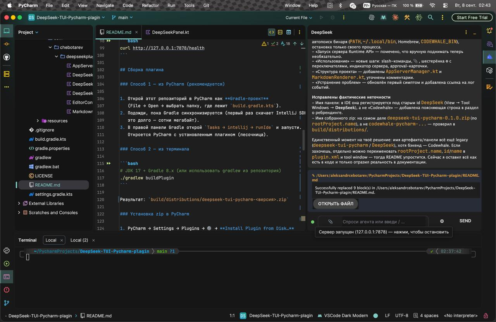

# Codewhale PyCharm Plugin

Плагин для PyCharm (Community), который связывает IDE с агентом
[Codewhale](https://github.com/Hmbown/CodeWhale) (ранее — DeepSeek-TUI) — как
Claude Code в IDE: открываешь файл (или выделяешь фрагмент), пишешь запрос в
панели, а открытый файл/выделение автоматически уходит агенту как контекст.
Агент работает в workspace проекта и имеет доступ ко всем файлам, а не только
к открытому.



## Возможности

- **Чат-интерфейс** — история разговора в виде скруглённых «пузырей»
  (твой запрос справа, ответ агента слева), автопрокрутка.
- **Стриминг** ответа по мере генерации (SSE).
- **Reasoning-режим** — «мышление» модели отделено от ответа, включается
  галочкой **Show thinking**.
- **Markdown-рендер** — код-блоки с подсветкой, заголовки, diff (`+`/`-`/`@@`).
- **Slash-команды** — `/clear`, `/compact`, `/undo`, `/help` (автодополнение
  при вводе `/`).
- **Прикрепление файла** — скрепкой 📎 в поле ввода, либо авто-прикрепление
  открытого файла / выделения в редакторе.
- **Approval-гейт** — при выключенном **Auto-approve** правки и команды
  агента требуют подтверждения (Разрешить / Разрешить всё / Запретить).
- **Дифф правок** — когда агент меняет файл, в чат падает блок `✎ <файл>` с
  диффом и кнопкой **«Открыть файл»**.
- **Управление сервером** — плагин сам поднимает/останавливает
  `codewhale app-server` (кликабельная точка слева от поля ввода: зелёная =
  запущен). Внешне запущенный сервер плагин не трогает.

## Важно: DeepSeek-TUI переименован в Codewhale

Проект тот же (автор Hmbown), но с версии v0.8.41 он называется `codewhale`,
а старое имя `deepseek-tui` устарело. Подробности миграции:
[docs/REBRAND.md](https://github.com/Hmbown/CodeWhale/blob/main/docs/REBRAND.md).

- Бинарь `deepseek` → теперь `codewhale` (короткий `codew`)
- Конфиг `~/.deepseek/` → `~/.codewhale/` (старое читается как fallback)
- **Модели и API DeepSeek не изменились**: `DEEPSEEK_API_KEY`,
  `deepseek-v4-pro` и т.д. работают как раньше
- Runtime API тот же: `app-server --http` на `127.0.0.1:7878`

## Как это работает

```
PyCharm (панель Codewhale)
        │  HTTP + SSE (localhost:7878)
        ▼
codewhale app-server --http   ← запускается плагином (или вручную)
        │
        ▼
DeepSeek V4 (через твой API-ключ)
```

Плагин НЕ запускает модель сам и НЕ хранит ключ. Он лишь:
1. Читает открытый файл / выделение в редакторе
2. Складывает их с твоим текстом в один запрос
3. Шлёт его в Runtime API Codewhale и стримит ответ обратно в панель

## Требования

- **PyCharm Community 2024.1+** (собиралось и тестировалось на 2024.1.4)
- **JDK 17** (нужен только для сборки плагина)
- **Codewhale** установлен и авторизован (см. ниже)

## Установка Codewhale (macOS)

```bash
# Рекомендованный путь — официальный установщик
curl -fsSL https://codewhale.net/install.sh | sh
"$HOME/.local/bin/codewhale" --version

# Или через Homebrew
brew tap Hmbown/deepseek-tui
brew install codewhale
```

### Добавление токена (API-ключ DeepSeek)

Ключ берётся в [платформе DeepSeek](https://platform.deepseek.com/) →
API Keys. Дальше — одна из трёх команд:

```bash
# 1) Интерактивно (спросит ключ и сохранит в ~/.codewhale/)
codewhale auth set --provider deepseek

# 2) Сразу с ключом в аргументе
codewhale auth set --provider deepseek --api-key "sk-..."

# 3) Либо через переменную окружения (без сохранения в конфиг)
export DEEPSEEK_API_KEY="sk-..."
```

Проверить, что ключ подхватился:

```bash
codewhale auth status
codewhale doctor    # проверяет ключ, провайдера, Runtime и PATH
```

> **Альтернативные провайдеры.** Codewhale умеет и другие бэкенды (NVIDIA NIM,
> Fireworks AI, OpenRouter, self-hosted SGLang и др.) — `codewhale auth set
> --provider <id>`. Список и настройка: `docs/CONFIGURATION.md` в репе Codewhale.
> Плагину это безразлично: он ходит только на локальный `localhost:7878`.

## Запуск сервера Runtime API

Плагин поднимает сервер сам — кликни по точке-индикатору слева от поля ввода
(или просто отправь первый запрос: сервер стартует автоматически).

Вручную (для отладки или внешнего запуска):

```bash
codewhale app-server --http --insecure-no-auth
```

`--insecure-no-auth` отключает требование токена — безопасно для loopback
(сервер слушает только `127.0.0.1`). Проверка живости:

```bash
curl http://127.0.0.1:7878/health
```

Если сервер уже запущен извне, плагин пометит точку зелёной и не будет им
управлять.

## Сборка плагина

### Способ 1 — из PyCharm (рекомендуется)

1. Открой этот репозиторий в PyCharm как **Gradle-проект**
   (File → Open → выбрать папку с `build.gradle.kts`).
2. Подожди синхронизацию Gradle (первый раз качает IntelliJ SDK — долго).
3. В панели Gradle открой `Tasks → intellij → runIde` и запусти.
   Откроется PyCharm с установленным плагином (песочница).

### Способ 2 — из терминала

```bash
./gradlew buildPlugin    # JDK 17 + Gradle 8.x
```

Результат: `build/distributions/deepseek-tui-pycharm-0.1.0.zip`

### Установка zip в PyCharm

1. PyCharm → Settings → Plugins → ⚙️ → **Install Plugin from Disk…**
2. Выбери `build/distributions/deepseek-tui-pycharm-0.1.0.zip`
3. Перезапусти PyCharm

## Использование

1. Открой файл проекта, с которым хочешь работать (или выдели фрагмент).
2. Открой панель **Codewhale** (View → Tool Windows → Codewhale).
3. В поле ввода напиши запрос и жми **Send** (или Enter).
4. Настройки — под кнопкой ⚙ справа: **Attach open file**, **Auto-approve**,
   **Show thinking**.

Ответ стримится в панель. Повторные запросы идут в ту же сессию (thread) —
контекст разговора сохраняется, как в чате. `📎` — прикрепить файл с диска,
`/` — список slash-команд.

## Структура проекта

```
src/main/
├── kotlin/com/chebotarev/deepseekplugin/
│   ├── DeepSeekToolWindowFactory.kt   # регистрация панели в IDE
│   ├── DeepSeekPanel.kt               # UI: чат-пузыри, поле ввода, настройки
│   ├── DeepSeekClient.kt              # HTTP/SSE-клиент к Runtime API
│   ├── AppServerManager.kt            # запуск/стоп процесса app-server
│   ├── EditorContextProvider.kt       # чтение открытого файла/выделения
│   └── MarkdownRenderer.kt            # markdown/diff → HTML (Swing-safe)
└── resources/META-INF/
    └── plugin.xml                     # дескриптор плагина
```

## Устранение проблем

| Симптом | Причина / решение |
|---|---|
| Точка-индикатор серая, сервер не стартует | Бинарь `codewhale` не найден. Проверь `codewhale --version`; при нестандартном пути задай `CODEWHALE_BIN` |
| «Не удалось запустить Codewhale server» | Смотри текст ошибки в панели; убедись, что `codewhale` установлен и `curl http://127.0.0.1:7878/health` отвечает |
| Ответ не стримится / обрывается | Проверь логи `app-server`, что ключ валиден и есть баланс |
| Плагин собрался, но панели нет | PyCharm < 2024.1 или неправильный JDK при сборке |
| 401/403 при запросах | Сервер запущен с требованием токена — перезапусти с `--insecure-no-auth` |
| Ошибка `gradle build` про `com.intellij.java` | Не менять `type.set("PC")`; плагин заточен под PyCharm Community |

## Лицензия

MIT. Основан на открытом Runtime API Codewhale.
Плагин не аффилирован с Codewhale/Shannon Labs и с DeepSeek Inc.
